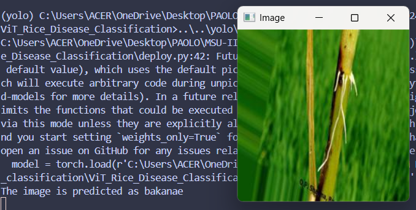

# ViT_Rice_Disease_Classification

## Overview
This project applies a **Vision Transformer (ViT)** model for rice disease classification.  
The Vision Transformer introduces the power of **self-attention mechanisms**—originally designed for NLP—into image classification tasks.  
Unlike traditional CNNs, ViT divides the image into patches and processes them as sequences, enabling the model to capture both **local and global dependencies** effectively.  

## Results
The trained model achieved an **overall accuracy of ~68%**, which highlights its ability to distinguish between different rice disease categories but also suggests room for further improvement.  
Despite this moderate accuracy, the model demonstrates how ViTs can be successfully applied in agricultural disease detection and lays the foundation for more fine-tuned approaches.  

Here are the evaluation results:

- 📊 **Classification Report**  
- 🔀 **Confusion Matrix**  
- 📈 **Model Evaluation Metrics**  
- 🎯 **Precision-Recall Curve for Multiclass with AUC**  

  
  
  

## Deployment Results

  

---

## Key Takeaways
- ✅ Introduced **Vision Transformers** for rice disease detection  
- ✅ Achieved **65% classification accuracy**  
- ✅ Demonstrated the potential of **transformer-based architectures** in agriculture  
- 🚀 Future work can include **data augmentation, hyperparameter tuning, and transfer learning** to boost performance further  
